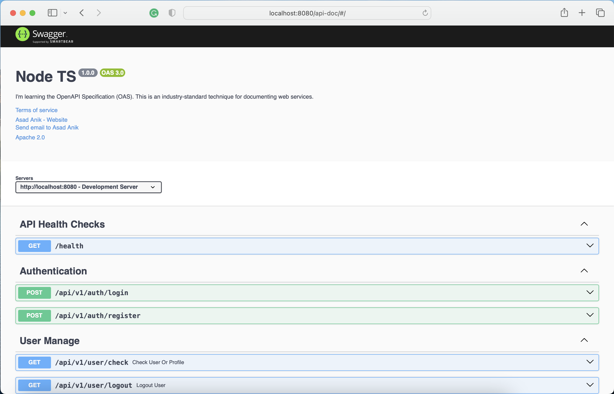

# Node TypeScript Backend Project Starter

## Installing
`npm install` or `yarn`
## Start dev server with Swagger documentation
`npm run dev:doc` or `yarn dev:doc`

## Start with ts-node 
`npm run start` or `yarn start`
## Start with ts-node and Swagger documentation
`npm run start:doc` or `yarn start:doc`
## Build Swagger documentation
`npm run generate-doc` or `yarn generate-doc`

# CLI commands

## Make Model for resource
`npm run make:model Post` or `yarn make:model Post`
## Make Service for resource
`npm run make:service post` or `yarn make:service post`
## Make Controller for resource
`npm run make:controller post` or `yarn make:controller post`
## Make Route for resource
`npm run make:route post` or `yarn make:route post`
## Make all at once
`npm run make:all post` or `yarn make:all post`
## Make all with Model
`npm run make:all:schema post` or `yarn make:all:schema post`

